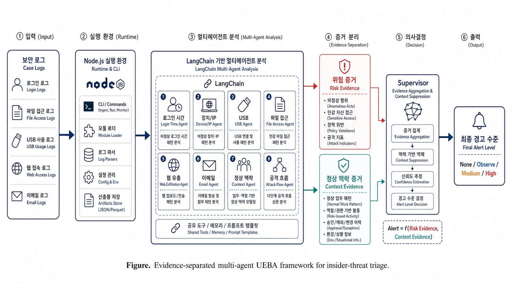

# Multi-Agent Evidence-Separated UEBA

이 저장소는 학회 발표용으로 정리한 **Node.js + LangChain 기반 Multi-Agent UEBA** 최소 구현체입니다.  
발표의 배경은 기존 SHIELD 자체의 한계가 아니라, **기존 보안 기술(SIEM, rule-based detection, 일반 UEBA, single-agent 판단)이 내부자 위협을 다룰 때 갖는 한계**입니다. SHIELD는 이 아이디어를 구현하고 실험하기 위해 사용한 코드 기반이며, 이 저장소는 그중 멀티에이전트 UEBA 핵심만 분리한 버전입니다.

팀원이 이 README만 읽어도 아래 내용을 이해할 수 있게 작성했습니다.

- 기존 보안 기술의 한계가 무엇인지
- 이번 Multi_UEBA가 그 한계를 어떻게 보완하는지
- 왜 멀티에이전트 구조가 필요한지
- PPT에서 어떤 흐름으로 설명하면 좋은지
- API key만 넣고 어떻게 실행하면 되는지



> Figure. Evidence-separated multi-agent UEBA framework for insider-threat triage.

---

## 1. 한 줄 요약

> 기존 보안 기술이 정해진 rule이나 단일 이상 점수 중심으로 내부자 위협을 판단했다면, Multi_UEBA는 보안 규칙을 여러 전문 AI 에이전트로 나누어 병렬 판단하고, 위험 증거와 정상 업무 맥락을 분리해 오탐을 줄이는 구조입니다.

조금 더 쉽게 말하면:

> 한 명의 AI가 모든 로그를 한 번에 판단하는 것이 아니라, 로그인 담당, 파일 담당, USB 담당, 이메일 담당, 정상 업무 맥락 담당처럼 여러 AI 분석가가 나눠서 보고, 마지막에 Supervisor가 종합 판단하는 방식입니다.

---

## 2. 기존 보안 기술의 탐지 방식

내부자 위협 탐지에서 주로 비교되는 기존 보안 기술은 크게 세 가지로 볼 수 있습니다.

| 기존 기술 | 핵심 방식 | 예시 |
|---|---|---|
| SIEM / Rule-based Detection | 정해진 조건이나 signature에 맞으면 경고 | 야간 로그인, USB 사용, 외부 메일 전송 rule |
| 일반 UEBA | 사용자/장비의 평소 행동 기준선을 만들고, 벗어나는 정도를 점수화 | 평소보다 늦은 접속, 평소보다 많은 다운로드 |
| Single-Agent LLM 판단 | 하나의 LLM이 전체 로그와 규칙을 한 번에 보고 판단 | 전체 case를 한 prompt에 넣고 위험 여부 판단 |

일반적인 탐지 흐름은 아래와 같습니다.

```text
보안 로그
  |
  v
Rule 또는 사용자 행동 baseline 적용
  |
  v
위험 점수 또는 rule match 계산
  |
  v
threshold를 넘으면 alert 생성
```

예를 들어:

| 상황 | 기존 보안 기술의 일반적 판단 |
|---|---|
| 사용자가 새벽 2시에 로그인 | 야간 로그인 rule 또는 시간대 이상 점수 증가 |
| 평소보다 많은 파일을 다운로드 | 다운로드량 이상 점수 증가 |
| USB 또는 외부 이메일 사용 | 유출 가능성 rule match |

즉 기존 방식은 대체로 **특정 조건에 걸렸는가** 또는 **평소보다 얼마나 다른가**를 중심으로 alert를 만듭니다.

---

## 3. 기존 보안 기술의 한계

기존 보안 기술은 명확한 규칙이나 단순 이상행동 탐지에는 유용하지만, 내부자 위협처럼 정상 계정과 정상 업무 도구를 사용하는 상황에서는 아래 한계가 있습니다.

| 한계 | 설명 |
|---|---|
| Rule 기반 탐지 한계 | rule에 명시되지 않은 내부자 행동 흐름은 놓치기 쉬움 |
| 단일 이상 점수 한계 | 여러 증거가 하나의 점수로 합쳐져 왜 위험한지 설명이 약해질 수 있음 |
| 정상 업무 맥락 처리 한계 | 야간 접속이나 대량 다운로드가 승인된 유지보수일 수도 있는데, 이를 별도로 분리하기 어려움 |
| Single-agent 판단 불안정 | 하나의 AI가 모든 규칙을 한 번에 보면 어떤 규칙은 놓치거나 판단 기준이 흔들릴 수 있음 |
| 오탐 문제 | 탐지 민감도를 높이면 정상 사용자를 위험으로 잘못 판단할 가능성이 커짐 |

중요한 문제는 이것입니다.

> 내부자 위협 탐지에서는 "평소와 다르다"만으로는 부족합니다. 그 행동이 실제 유출 흐름인지, 아니면 정상 업무로 설명되는 행동인지까지 구분해야 합니다.

---

## 4. 이번 Multi_UEBA가 보완한 점

이번 구현은 기존 보안 기술의 한계를 아래 방향으로 보완합니다.

| 구분 | 기존 보안 기술 | Multi_UEBA |
|---|---|---|
| 판단 구조 | rule match 또는 단일 이상 점수 중심 | 여러 specialist agent가 병렬 판단 |
| AI 사용 방식 | single-agent가 전체 로그를 한 번에 판단 | LangChain 기반 LLM specialist agent |
| 증거 처리 | 위험 신호와 정상 사유가 섞이기 쉬움 | 위험 증거와 정상 맥락 증거 분리 |
| 최종 판단 | threshold 중심 | Supervisor가 agent 결과 종합 |
| 발표 포인트 | 기존 탐지 기술의 내부자 위협 한계 | 멀티에이전트 + evidence separation으로 오탐 감소 |

핵심 변화:

```text
기존:
로그 -> rule match 또는 단일 위험 점수 -> alert

변경:
로그 -> 여러 전문 에이전트가 병렬 분석 -> 정상 맥락 분리 -> Supervisor 종합 -> alert
```

---

## 5. Node.js와 LangChain은 여기서 어떤 역할인가?

이 프로젝트는 **Node.js + LangChain**으로 구성되어 있습니다.

처음 듣는 사람 기준으로 설명하면:

| 구성 | 쉬운 설명 | 이 프로젝트에서 하는 일 |
|---|---|---|
| Node.js | JavaScript 프로그램 실행 환경 | CLI 실행, 데이터셋 읽기, agent 병렬 실행 |
| LangChain | LLM 기반 agent를 만들기 쉽게 해주는 프레임워크 | OpenAI 모델을 호출하고 agent별 prompt를 실행 |
| OpenAI API | 실제 LLM 판단 모델 | 각 specialist agent의 판단 생성 |
| Supervisor | 최종 의사결정 로직 | agent 결과를 모아 `none / observe / medium / high` 판단 |

비유하면:

> Node.js는 프로그램이 돌아가는 작업장이고, LangChain은 AI 직원들에게 각자 업무를 배정하는 관리 도구입니다.

---

## 6. Multi-Agent 구조

이번 구현에서는 보안 로그를 하나의 AI가 모두 보는 대신, 아래처럼 역할별 agent가 나누어 봅니다.

| Agent | 담당 질문 | 보는 증거 |
|---|---|---|
| `login_time_agent` | 접속 시간이 이상한가? | 야간/주말 로그인, 평소 활동 시간 |
| `device_ip_agent` | 낯선 PC/IP인가? | device, IP, user profile |
| `usb_agent` | USB 같은 이동식 매체를 썼는가? | removable media, file copy |
| `file_access_agent` | 파일 접근량이 이상한가? | 다운로드 수, 문서 접근량, 민감 문서 |
| `web_exfil_agent` | 외부 유출 경로에 접근했는가? | Dropbox, Wikileaks, job site, upload |
| `email_agent` | 외부 이메일 전송이 있었는가? | 외부 수신자, 첨부파일 |
| `memory_agent` | 과거 위반 패턴과 닮았는가? | prior violation memory |
| `context_exception_agent` | 정상 업무 사유가 있는가? | 승인 예외, 유지보수, 교육, incident review |
| `case_flow_agent` | 여러 행동이 공격 흐름인가? | login -> file -> USB/web/email chain |

구조는 다음과 같습니다.

```text
Case logs
   |
   v
Specialist agents run in parallel
   |
   +-- login_time_agent
   +-- device_ip_agent
   +-- usb_agent
   +-- file_access_agent
   +-- web_exfil_agent
   +-- email_agent
   +-- memory_agent
   +-- context_exception_agent
   +-- case_flow_agent
   |
   v
Supervisor
   |
   v
Final alert
none / observe / medium / high
```

---

## 7. Evidence-Separated 구조

멀티에이전트만 사용하면 탐지율은 올라가지만, 정상인데 위험해 보이는 행동도 함께 잡을 수 있습니다.

예를 들어:

```text
야간 로그인 + 대량 파일 다운로드
```

이것만 보면 위험해 보입니다. 하지만 실제로는 승인된 유지보수나 훈련용 데이터 export일 수도 있습니다.

그래서 이번 구조에서는 증거를 두 종류로 나눕니다.

| 증거 유형 | 예시 | 역할 |
|---|---|---|
| 위험 증거 | 야간 로그인, USB 사용, 대량 다운로드, 외부 업로드 | alert 가능성을 높임 |
| 정상 맥락 증거 | 승인된 유지보수, approved exception, training export, incident review | 오탐 가능성을 낮춤 |

핵심은 이 부분입니다.

> 정상 맥락은 위험 점수에 섞지 않고 별도 agent가 판단하게 했습니다. Supervisor는 위험 증거와 정상 맥락을 비교해 최종 alert를 결정합니다.

예시:

```text
file_access_agent:
  파일 다운로드가 많다 -> 위험

login_time_agent:
  야간 접속이다 -> 위험

context_exception_agent:
  승인된 유지보수 작업이다 -> 정상 맥락

Supervisor:
  위험해 보이지만 정상 사유가 강하므로 observe 또는 none으로 낮춤
```

이 구조가 발표에서 가장 중요한 차별점입니다.

---

## 8. 최종 실험 결과

발표에는 30개 smoke set보다 더 믿을 수 있는 **60개 stability case** 결과를 사용하는 것이 좋습니다.

| 항목 | 값 |
|---|---|
| 평가 단위 | case-level |
| 평가 case 수 | 60 |
| Positive / Normal | 30 / 30 |
| 사용 데이터 | `data/datasets/stability_cases.json` |
| 모델 | `gpt-4.1-mini` |
| 구현 | Node.js + LangChain |

결과:

| Method | Precision | Recall | F1 | FP | FN |
|---|---:|---:|---:|---:|---:|
| Existing SIEM | 0.0% | 0.0% | 0.0% | 0 | 30 |
| Single-Agent UEBA | 100.0% | 33.3% | 50.0% | 0 | 20 |
| Multi-Agent UEBA | 77.8% | 93.3% | 84.8% | 8 | 2 |
| Multi-Agent + Evidence-Separated UEBA | 100.0% | 93.3% | 96.6% | 0 | 2 |

해석:

> Multi-Agent UEBA는 Single-Agent UEBA보다 실제 위협을 훨씬 많이 잡았습니다. 다만 정상 케이스 8건을 오탐했습니다. Evidence-Separated 구조를 적용하자 Recall 93.3%는 유지하면서 FP를 8건에서 0건으로 줄였고, F1-score는 84.8%에서 96.6%로 개선되었습니다.

즉 발표에서는 이렇게 말하면 됩니다.

> 멀티에이전트 구조는 탐지율을 높였고, evidence-separated 구조는 멀티에이전트의 오탐을 줄였다.

---

## 9. PPT를 만들 때 추천 흐름

팀원이 PPT를 만든다면 아래 흐름을 그대로 쓰면 됩니다.

| Slide | 제목 | 핵심 메시지 |
|---:|---|---|
| 1 | 연구 제목 | Multi-Agent Evidence-Separated UEBA |
| 2 | 문제 정의 | 내부자 위협은 정상 계정과 정상 도구를 사용해 탐지가 어렵다 |
| 3 | 기존 보안 기술 | SIEM, rule 기반 탐지, 일반 UEBA의 작동 방식 |
| 4 | 기존 보안 기술의 한계 | rule, 단일 점수, single-agent 판단은 정상 업무 맥락을 분리하기 어렵다 |
| 5 | 제안 구조 | 규칙별 specialist agent가 병렬로 판단한다 |
| 6 | Agent 역할 | 로그인, 파일, USB, 웹, 이메일, 정상맥락 agent 설명 |
| 7 | Evidence Separation | 위험 증거와 정상 업무 맥락을 분리한다 |
| 8 | 실험 설계 | 60개 stability case, SIEM/Single/Multi/Evidence 비교 |
| 9 | 실험 결과 | FP 8 -> 0, F1 84.8% -> 96.6% |
| 10 | 실패 케이스 | scenario 2 계열 FN 2건이 남아있다 |
| 11 | 결론 | 탐지율은 유지하면서 오탐을 줄인 구조 |

PPT 핵심 문장:

> 기존 보안 기술이 rule 또는 단일 이상 점수 중심으로 내부자 위협을 판단했다면, 본 연구는 이를 멀티에이전트 기반 판단 구조로 확장하고, 정상 업무 맥락을 별도로 분리해 오탐을 줄였다.

---

## 10. 발표에서 조심해야 할 표현

| 피해야 할 표현 | 권장 표현 |
|---|---|
| 전체 CERT에서 96.6% F1을 달성했다 | 선택된 60개 stability case에서 F1 96.6%를 기록했다 |
| 오탐이 완전히 없다 | 해당 평가셋에서는 FP가 0건이었다 |
| LLM을 학습시켰다 | LangChain으로 specialist agent를 구성했다 |
| 기존 SHIELD의 한계를 해결했다 | 기존 보안 기술의 내부자 위협 탐지 한계를 배경으로, SHIELD 코드 기반에서 멀티에이전트 구조를 구현했다 |
| SIEM은 쓸모없다 | SIEM은 rule 기반 탐지에는 강하지만 내부자 행동 흐름 탐지에는 한계가 있다 |

---

## 11. 폴더 구조

```text
packages/shield_core/src/agents/
  multi-agent 핵심 구현

tools/cli/
  dataset build / LLM triage 실행 CLI

tools/test/
  multi-agent 단위 테스트

data/datasets/
  바로 실행 가능한 case-level 평가셋

docs/
  발표 흐름 및 구현 결과 정리

results/
  최종 60-case 실험 결과 요약
```

핵심 파일:

| 파일 | 역할 |
|---|---|
| `packages/shield_core/src/agents/specialist_prompts.js` | agent별 역할 prompt |
| `packages/shield_core/src/agents/langchain_agent_runner.js` | LangChain/OpenAI 호출 |
| `packages/shield_core/src/agents/parallel_triage.js` | specialist agent 병렬 실행 |
| `packages/shield_core/src/agents/supervisor.js` | 최종 alert 판단 |
| `tools/cli/run_multi_agent_triage_eval.js` | 평가 실행 CLI |
| `data/datasets/stability_cases.json` | 발표용 60-case 평가셋 |
| `results/final_multi_agent_comparison_stability60/final_method_comparison.md` | 최종 결과표 |

---

## 12. 바로 실행하기

이 저장소에는 발표용으로 사용한 작은 case-level 평가 데이터셋이 포함되어 있습니다.

포함 데이터:

```text
data/datasets/dev_smoke_cases.json     # 30 cases
data/datasets/stability_cases.json     # 60 cases
data/datasets/case_labels.json
data/datasets/dataset_manifest.json
```

따라서 원본 CERT 데이터셋 없이도, API key만 넣으면 LLM multi-agent 평가를 바로 실행할 수 있습니다.

### 1. 설치

```bash
git clone https://github.com/yusin8/Multi_UEBA.git
cd Multi_UEBA
npm install
```

### 2. API key 설정

```bash
cp .env.example .env
```

`.env`에 본인 키를 넣습니다.

```bash
OPENAI_API_KEY=...
LANGSMITH_API_KEY=...
LANGSMITH_TRACING=true
```

### 3. 테스트

```bash
npm test
```

### 4. LLM 평가 실행

작은 smoke set:

```bash
npm run eval:llm:smoke
```

발표에 사용한 60개 stability set:

```bash
npm run eval:llm:stability
```

LLM 비용 없이 deterministic baseline만 확인:

```bash
npm run eval:deterministic
```

---

## 13. 최종 인수인계 요약

팀원이 알아야 할 핵심은 아래 세 줄입니다.

1. 발표 배경은 기존 SHIELD가 아니라 SIEM, rule-based detection, 일반 UEBA 같은 기존 보안 기술의 한계이다.
2. Multi_UEBA는 Node.js + LangChain으로 규칙별 specialist agent를 병렬 구성한 제안 구조이다.
3. Evidence-separated 구조를 통해 멀티에이전트의 높은 Recall을 유지하면서 FP를 8건에서 0건으로 줄였다.

PPT는 이 세 줄을 중심으로 만들면 됩니다.

---

## 14. 주의

- 이 결과는 전체 CERT 전체 로그 성능이 아니라, 선택된 60개 stability case 기준입니다.
- 원본 CERT 데이터셋과 API key는 저장소에 포함하지 않았습니다.
- 저장소에는 재현용으로 가공된 case-level 평가셋만 포함했습니다.
- LLM을 파인튜닝한 것이 아니라, LangChain 기반 specialist agent를 구성한 것입니다.
